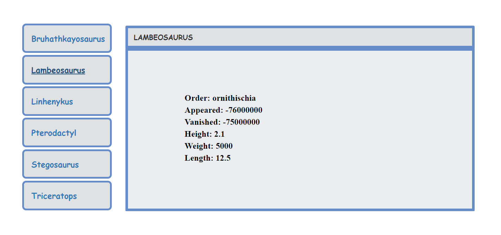

<p align="center">
  <a href="https://github.com/sushmithashakthivel/dinosaurs">
    
  </a>
</p>

___

<p align="center">Dinosaur Detail</p>
<p align="center">
  <a href="https://github.com/sushmithashakthivel/dinosaurs">
    
  </a>
</p>

___

# React ES6+JSX+Fetch Learning Project

The technology stack used in the project:

- [React](https://facebook.github.io/react/) and [JSX](https://facebook.github.io/jsx/) — a virtual DOM JavaScript library for rendering UI.  It's about rendering view as a function of state, making JavaScript-driven UI declarative the way HTML is declarative.
- [Webpack 2](https://gist.github.com/sokra/27b24881210b56bbaff7) and [webpack dev server](https://github.com/webpack/webpack-dev-server) — client-side module builder and dev server that serves the app.
- [React Router v3](https://github.com/reactjs/react-router/blob/next/CHANGES.md) — to allow [dynamic routing](https://github.com/reactjs/react-router/blob/master/docs/guides/DynamicRouting.md)
- [npm](https://www.npmjs.com/) — package manager
- [Babel 6](http://babeljs.io/) — transpiler from ES6 / JSX to ES5, which is supported by all browsers
- [Isomorphic Fetch](https://github.com/matthew-andrews/isomorphic-fetch) — Isomorphic WHATWG Fetch API, for Node & Browserify

## Getting Started

### Prerequisites

Support for Node.js > 5.

### Installation

```sh
$ git clone https://github.com/sushmithashakthivel/dinosaurs.git
$ cd dinosaurs
$ npm install
```
### Run

```sh
$ npm start
```

Project running in the url: http://localhost:8080
